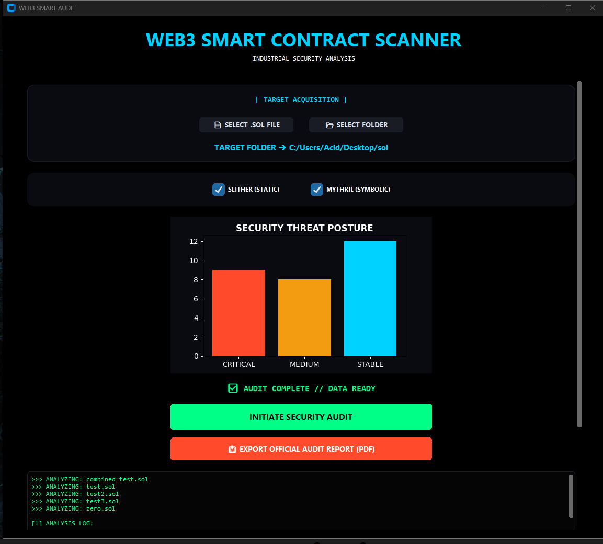
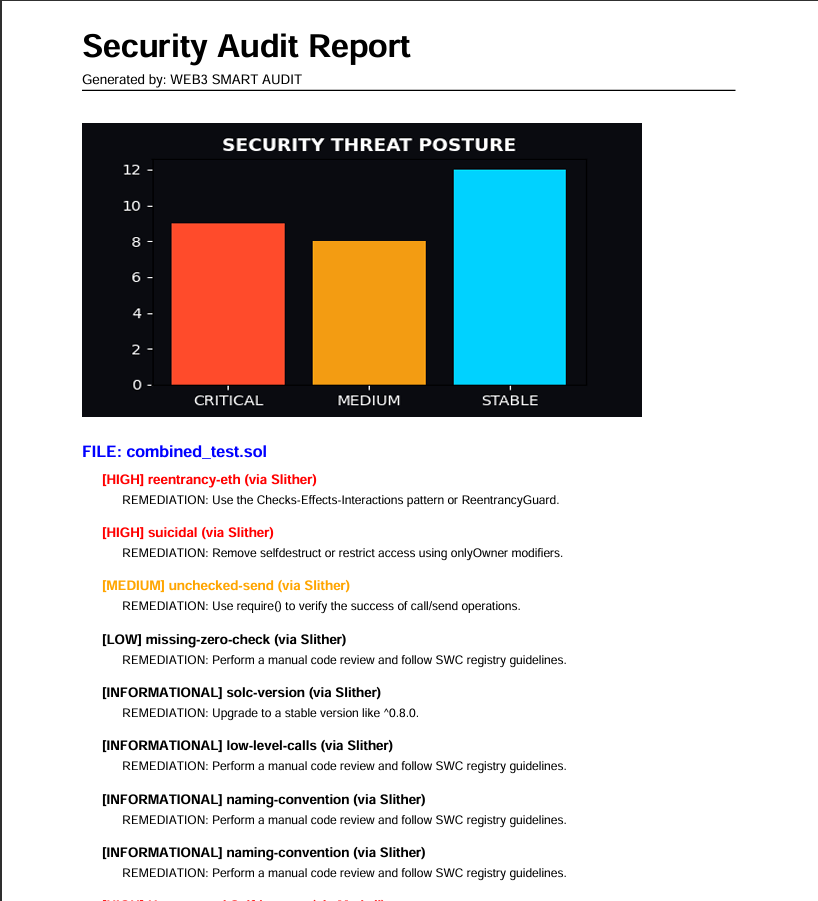

<div align="center">


<br/>

```
███████╗███╗   ███╗ █████╗ ██████╗ ████████╗     ██████╗ ██████╗ ███╗   ██╗████████╗
██╔════╝████╗ ████║██╔══██╗██╔══██╗╚══██╔══╝    ██╔════╝██╔═══██╗████╗  ██║╚══██╔══╝
███████╗██╔████╔██║███████║██████╔╝   ██║       ██║     ██║   ██║██╔██╗ ██║   ██║   
╚════██║██║╚██╔╝██║██╔══██║██╔══██╗   ██║       ██║     ██║   ██║██║╚██╗██║   ██║   
███████║██║ ╚═╝ ██║██║  ██║██║  ██║   ██║       ╚██████╗╚██████╔╝██║ ╚████║   ██║   
╚══════╝╚═╝     ╚═╝╚═╝  ╚═╝╚═╝  ╚═╝   ╚═╝        ╚═════╝ ╚═════╝ ╚═╝  ╚═══╝   ╚═╝  
                   ███████╗ ██████╗ █████╗ ███╗   ██╗███╗   ██╗███████╗██████╗      
                   ██╔════╝██╔════╝██╔══██╗████╗  ██║████╗  ██║██╔════╝██╔══██╗     
                   ███████╗██║     ███████║██╔██╗ ██║██╔██╗ ██║█████╗  ██████╔╝     
                   ╚════██║██║     ██╔══██║██║╚██╗██║██║╚██╗██║██╔══╝  ██╔══██╗     
                   ███████║╚██████╗██║  ██║██║ ╚████║██║ ╚████║███████╗██║  ██║     
                   ╚══════╝ ╚═════╝╚═╝  ╚═╝╚═╝  ╚═══╝╚═╝  ╚═══╝╚══════╝╚═╝  ╚═╝   
```

<br/>

[](https://python.org)
[](https://docker.com)
[](https://github.com/crytic/slither)
[](https://github.com/Consensys/mythril)
[](https://soliditylang.org)
[](LICENSE)
[](https://github.com/onlyrahimsec/Web3-Smart-Contract-Scanner)

<br/>

> **⚡ Dual-engine automated security auditing for Ethereum smart contracts.**  
> **Slither** (Static Analysis) + **Mythril** (Symbolic Execution) — scan files or entire folders with PDF reports and visual analytics.

<br/>

[🚀 Quick Start](#-quick-start) • [🎯 Features](#-features) • [🏗 Architecture](#-technical-architecture) • [📦 Installation](#-installation) • [🖥 Usage](#-usage) • [📸 Screenshots](#-screenshots--proof-of-results) • [🛡 Vulnerabilities Detected](#-vulnerabilities-detected) • [👤 Author](#-author)

---

</div>

## 🎯 Features

```
┌─────────────────────────────────────────────────────────────────────────────┐
│                        SCANNER CAPABILITY MATRIX                            │
├───────────────────────────────────────┬─────────────────────────────────────┤
│  ✅ Slither — Static Analysis          │  ✅ Mythril — Symbolic Execution     │
│  ✅ Reentrancy Detection               │  ✅ Bulk Folder Scanning             │
│  ✅ Suicidal / Self-Destruct Risks     │  ✅ Visual Vulnerability Bar Chart   │
│  ✅ Unchecked Return Values            │  ✅ Professional PDF Report Export   │
│  ✅ Integer Overflow / Underflow       │  ✅ Access Control Analysis          │
│  ✅ Low-Level Call Detection           │  ✅ Naming Convention Warnings       │
│  ✅ Compiler Version Checks            │  ✅ Modern Dark GUI Interface        │
│  ✅ Isolated Docker Execution          │  ✅ Solidity (.sol) File Support      │
└───────────────────────────────────────┴─────────────────────────────────────┘
```

- 🔍 **Slither — Static Analysis** — Powered by [Slither](https://github.com/crytic/slither), Trail of Bits' industry-standard framework; blazing fast, zero execution required
- 🧠 **Mythril — Symbolic Execution** — Powered by [Mythril](https://github.com/Consensys/mythril) by ConsenSys; explores all possible execution paths to catch deep logic bugs Slither may miss
- 📂 **Bulk Folder Audit** — Recursively scan an entire project folder and audit every `.sol` file in one click
- 📊 **Visual Statistics** — Live bar chart showing High / Medium / Low vulnerability distribution after every scan
- 📄 **PDF Report Export** — Export a clean, professional audit report to any location on your system
- 🐳 **Docker Isolated** — Slither runs in `trailofbits/eth-security-toolbox`; Mythril runs in `mythril/myth` — fully sandboxed
- 🖥️ **Modern GUI** — Built with `customtkinter` for a clean, distraction-free dark-mode auditing experience
- ⚡ **Fast Pipeline** — From file selection to full dual-engine audit report in seconds

---

## 🏗 Technical Architecture

```
┌──────────────────────────────────────────────────────────────────────────────┐
│                                                                              │
│    ┌───────────────────┐        ┌──────────────────────────────────────┐    │
│    │     User GUI      │        │     Docker Container  [Slither]      │    │
│    │    (gui.py)       │        │   trailofbits/eth-security-toolbox   │    │
│    │                   │──────▶ │                                      │    │
│    │  customtkinter    │ stdin  │  ┌──────────┐   ┌────────────────┐  │    │
│    │                   │        │  │  Slither  │──▶│ Static Detectors│  │    │
│    │  📄 File Picker   │        │  └──────────┘   └───────┬────────┘  │    │
│    │  📂 Folder Picker │◀────── │                          │ JSON      │    │
│    │  📊 Bar Chart     │ stdout └──────────────────────────┼──────────┘    │
│    │  📥 PDF Export    │                                   │               │
│    │                   │        ┌──────────────────────────┼──────────┐    │
│    │   (scanner.py)    │        │     Docker Container  [Mythril]     │    │
│    │                   │──────▶ │          mythril/myth               │    │
│    │                   │ stdin  │                                      │    │
│    │                   │        │  ┌──────────┐   ┌────────────────┐  │    │
│    │                   │        │  │  Mythril  │──▶│  Symbolic Exec │  │    │
│    └───────────────────┘◀────── │  └──────────┘   └───────┬────────┘  │    │
│                          stdout │                          │ JSON      │    │
│                                 └──────────────────────────────────────┘    │
│                                                                              │
│           Python Orchestration Layer  ·  scanner.py  ·  subprocess           │
└──────────────────────────────────────────────────────────────────────────────┘
```

The scanner is a **Python-based dual-engine orchestration layer** that:
1. Accepts `.sol` files or entire folders via GUI
2. Recursively collects all Solidity contracts from the selected path
3. **Engine 1 — Slither:** Mounts each contract into `trailofbits/eth-security-toolbox`; runs fast static pattern matching
4. **Engine 2 — Mythril:** Mounts each contract into `mythril/myth`; performs deep symbolic execution to find runtime logic flaws
5. Merges results, renders a severity bar chart + structured findings list in the GUI
6. Exports a clean unified PDF audit report to a user-chosen location

---

## 📦 Installation

### Prerequisites

| Tool | Version | Check Command |
|------|---------|---------------|
| Python | 3.10+ | `python --version` |
| Docker Desktop | 20.10+ | `docker --version` |
| Git | Any | `git --version` |

> ⚠️ Make sure **Docker Desktop is running** before launching the scanner.

---

### Step 1 — Clone the Repository

```bash
git clone https://github.com/onlyrahimsec/Web3-Smart-Contract-Scanner.git
cd Web3-Smart-Contract-Scanner
```

### Step 2 — Install Python Dependencies

```bash
pip install customtkinter matplotlib reportlab
```

### Step 3 — Pull the Security Toolbox Images

```bash
# Slither engine (Trail of Bits)
docker pull trailofbits/eth-security-toolbox

# Mythril engine (ConsenSys)
docker pull mythril/myth
```

> 💡 These images bundle all required Solidity compilers and analysis tools. Pull once, audit forever.

### Step 4 — Launch the Scanner

```bash
python gui.py
```

---

## 🚀 Quick Start

```bash
# 5 commands. That's it.
git clone https://github.com/onlyrahimsec/Web3-Smart-Contract-Scanner.git
cd Web3-Smart-Contract-Scanner
pip install customtkinter matplotlib reportlab
docker pull trailofbits/eth-security-toolbox
docker pull mythril/myth
python gui.py
```

---

## 🖥 Usage

Once the GUI launches:

```
 ┌──────────────────────────────────────────────────────────────┐
 │         🛡️  Web3 Smart Contract Scanner                      │
 │──────────────────────────────────────────────────────────────│
 │                                                              │
 │   [ 📄  Select File ]       [ 📂  Select Folder ]           │
 │                                                              │
 │   Selected: C:/Users/.../sol/                                │
 │                                                              │
 │   ──────────────── Vulnerability Distribution ────────────  │
 │   █████ High (5)    ██ Medium (1)    ████████ Low/Info (9)  │
 │                                                              │
 │              [ 🚀  Run Bulk Audit ]                          │
 │              [ 📥  Export PDF Report ]                       │
 │                                                              │
 │  🔍 Found 4 files. Starting audit...                        │
 │  🛠️ Auditing: combined_test.sol...                          │
 │  ✅ Audit Complete!                                          │
 │  ════════════════════════════════════════════                │
 │  📍 combined_test.sol: [High] reentrancy-eth                 │
 │     Fix: Use ReentrancyGuard.                                │
 │  📍 combined_test.sol: [High] suicidal                       │
 │     Fix: Add onlyOwner checks.                               │
 └──────────────────────────────────────────────────────────────┘
```

**Step-by-step workflow:**

1. **Select Target** — Click `📄 Select File` for a single `.sol` file, or `📂 Select Folder` to scan an entire project directory
2. **Run Audit** — Click `🚀 Run Bulk Audit` — Docker starts automatically and scans all found contracts
3. **Analyze Results** — View the live bar chart and detailed findings list with severity tags and fix suggestions
4. **Export Report** — Click `📥 Export PDF Report`, choose a save location, and get your professional audit document ✅

---

## 📸 Screenshots & Proof of Results

### 🖥️ Main GUI — Live Bulk Scan Result

> *Scanned 4 Solidity files — 15 total issues detected across High / Medium / Low / Informational categories*



---

### 📄 Exported PDF Audit Report

> *Professional report generated from the same scan session — ready to share with clients or teams*

```
Web3 Smart Contract Scanner - Report
Total Issues Found: 15
──────────────────────────────────────────────────────────────
[HIGH]          reentrancy-eth       →  combined_test.sol
[HIGH]          suicidal             →  combined_test.sol
[MEDIUM]        unchecked-send       →  combined_test.sol
[LOW]           missing-zero-check   →  combined_test.sol
[INFORMATIONAL] solc-version         →  combined_test.sol
[INFORMATIONAL] low-level-calls      →  combined_test.sol
[INFORMATIONAL] naming-convention    →  combined_test.sol
[HIGH]          reentrancy-eth       →  test.sol
[INFORMATIONAL] solc-version         →  test.sol
[INFORMATIONAL] low-level-calls      →  test.sol
[HIGH]          reentrancy-eth       →  test2.sol
[HIGH]          suicidal             →  test2.sol
[INFORMATIONAL] solc-version         →  test2.sol
[INFORMATIONAL] low-level-calls      →  test2.sol
──────────────────────────────────────────────────────────────
```



---

## 🛡 Vulnerabilities Detected

| Severity | Vulnerability Type | Impact | Fix |
|----------|--------------------|--------|-----|
| 🔴 **HIGH** | `reentrancy-eth` | Funds can be drained repeatedly via re-entry | Use `ReentrancyGuard` |
| 🔴 **HIGH** | `suicidal` | Anyone can destroy the contract | Add `onlyOwner` checks |
| 🟠 **MEDIUM** | `unchecked-send` | Failed transfers go undetected | Strictly check return values |
| 🟡 **LOW** | `missing-zero-check` | Zero-address assignments cause silent bugs | Validate all address inputs |
| 🔵 **INFO** | `solc-version` | Outdated compiler may have known bugs | Use `^0.8.0` or later |
| 🔵 **INFO** | `low-level-calls` | Risky use of `.call()` / `.send()` | Prefer `transfer()` or checks-effects-interactions |
| 🔵 **INFO** | `naming-convention` | Non-standard variable/function naming | Follow Solidity style guide |

---

## 📁 Project Structure

```
Web3-Smart-Contract-Scanner/
│
├── 📄 gui.py                  # Main GUI — customtkinter app + chart + PDF export
├── 📄 scanner.py              # Docker orchestration + Slither & Mythril JSON parsers
├── 📄 requirements.txt        # Python dependencies
├── 📄 README.md               # You are here
├── 📄 LICENSE                 # MIT License
│
├── 📂 assets/                 # Screenshots and images for README
│   ├── screenshot_ui.png      # Main GUI screenshot
│   └── report_preview.png     # PDF report screenshot
│
├── 📂 contracts/              # Sample vulnerable contracts for testing
│   ├── combined_test.sol      # Multi-vulnerability demo contract
│   ├── test.sol               # Reentrancy demo
│   └── test2.sol              # Suicidal + reentrancy demo
│
└── 📂 reports/                # Exported PDF audit reports (generated at runtime)
    └── Audit_Report.pdf
```

---

## ⚙️ Configuration

| Option | Default | Description |
|--------|---------|-------------|
| Engine 1 | `Slither` | Static analysis — fast pattern-based detection |
| Engine 2 | `Mythril` | Symbolic execution — deep runtime logic analysis |
| Docker Image (Slither) | `trailofbits/eth-security-toolbox` | Slither container |
| Docker Image (Mythril) | `mythril/myth` | Mythril container |
| Output Format | Plain Text + JSON → PDF | Report format |
| Slither Timeout | `120s` | Max duration per contract |
| Mythril Timeout | `60s` (execution-timeout) | Max symbolic execution time |
| File Types | `.sol` | Supported contract languages |

---


## 🤝 Contributing

Contributions are welcome!

```
Fork → Branch → Commit → Pull Request
```

1. **Fork** the repository
2. Create your feature branch: `git checkout -b feature/my-new-detector`
3. Commit your changes: `git commit -m "feat: add detector for X"`
4. Push to branch: `git push origin feature/my-new-detector`
5. Open a **Pull Request**

Please open an **Issue** first for major changes to discuss the approach.

---

## ⚠️ Disclaimer

> This tool is intended **exclusively for educational and ethical security research purposes.**  
> Only audit contracts you own or have explicit written permission to test.  
> The author assumes no liability for misuse of this software.

---

## 📄 License

This project is licensed under the **MIT License** — see the [LICENSE](LICENSE) file for full details.

---

<div align="center">

## 👤 Author

**Md Rahim Rahman**  
*Certified Cybersecurity Technician (CCT) | Certified Ethical Hacker (CEH)*

[](https://github.com/onlyrahimsec)
[](https://rahimsec.com)

<br/>

*Built with ❤️ for the Web3 security community*

<br/>

---

⭐ **If this tool helped you secure a smart contract, please star the repo!** ⭐

```

```

</div>
